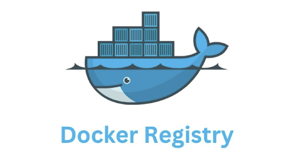

<p align="center">

</p>

Repository contains Ansible configuration for deploying a secure private Docker Registry running behind an Nginx-based reverse proxy. The solution is designed for use within corporate or personal infrastructure and provides multi-layered access protection.

## ☘ Features

- **Docker Registry** (registry:3) for storing and distributing container images
- **Nginx** as a reverse proxy for request routing and TLS connection handling
- **Basic Auth** using htpasswd for user authentication
- **IP access filtering**, allowing you to restrict the registry to trusted networks or hosts
- **HTTPS** support with a LetsEncrypt or self-signed certificate, suitable for isolated and closed environments

## 🧰 Requirements
- Remote server with Debian 12 and Python 3 installed
- Local Ansible and sshpass package installed

## 🚀 Installation
**Locally:**
1. Run ```make init``` to create config files
2. Fill `hosts.yml` with remote server auth data; fill `group_vars/all.yml` with registry settings
3. Run ```make deploy```
4. Login to registry:
```bash
# For selfsigned TLS: add insecure registry
$ sudo nano /etc/docker/daemon.json
{ "insecure-registries": ["REGISTRY_IP:5000"] }

# Restart Docker service to apply changes
$ sudo service docker restart

# Run one-line repository login command
$ echo 'REGISTRY_PASSWORD' | docker login REGISTRY_IP:5000 --username REGISTRY_USERNAME --password-stdin
```

## 💡 Work checking

```bash
# Preparing new image
docker pull nginx:latest
docker tag nginx:latest REGISTRY_IP:5000/my_project/my_nginx:1.0.0

# Pushing
docker push REGISTRY_IP:5000/my_project/my_nginx:1.0.0

# Pulling
docker image rm REGISTRY_IP:5000/my_project/my_nginx:1.0.0
docker pull REGISTRY_IP:5000/my_project/my_nginx:1.0.0
```

## 🏗 Usage flow
### 1. Locally (push images to registry):
Let's assume in your project you have a file `docker-compose.yml`:
```
services:
  nginx:
    image: REGISTRY_IP:5000/my_project/my_image:1.0.0
    build:
      context: ./dockerfiles
      dockerfile: nginx.dockerfile
    ports:
      - '10080:80'
```

Then you can build and push image to the registry:
```bash
$ docker compose build
$ docker compose push
```
After that, the new image tag must appear in a tags list of the registy.
https://REGISTRY_IP:5000/v2/my_project/my_image/tags/list

### 2. Remote server (pull images from registry):
Login to the registry, by running commands from Installation section.
<br>
Copy `docker-compose.yml` to the remote server and run commands there:
```bash
# For pull new docker-compose.yml with updated images version number
$ git pull

$ docker compose pull
$ docker compose up -d
```

## 📝 Endpoints
```bash
# Repositories list
https://REGISTRY_IP:5000/v2/_catalog

# Repository tags list
https://REGISTRY_IP:5000/v2/my_image/tags/list
```
